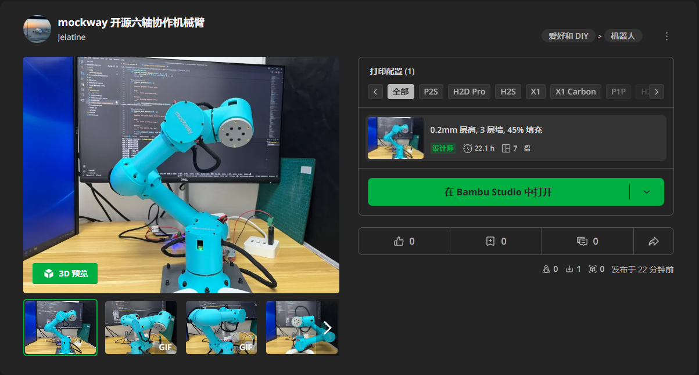
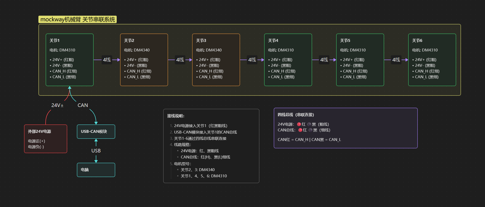

# Mockway Robotics

**[中文](README.md) | English**

Open-source 6-axis collaborative robotic arm system, including mechanical structure, electronics, and software.

[](https://www.bilibili.com/video/BV1AxrbBWEjN/)

> The test program in the video is the `tools/dynamics_test/real/inverse_dynamics_test.py` script
>
> After running, select: 1 - Gravity Compensation Mode
>
> Configure serial port and other information in `tools/dynamics_test/dynamics_test.yaml` according to your setup

CAN device uses [WitMotion USB-CAN Module](https://detail.tmall.com/item.htm?id=598670674373&skuId=4483773298672), serial baud rate 921600, CAN bus baud rate 1M

## ⚙️ Mechanical Structure

Parametric modeling using `JellyCAD`, model parameters are in the `/jellycad_src` directory. Software download: [JellyCAD v0.3.10](https://github.com/Jelatine/JellyCAD/releases/tag/v0.3.10)

Structural parts can be 3D printed, uploaded to [MakerWorld](https://makerworld.com.cn/zh/models/2037149-mockway-kai-yuan-liu-zhou-xie-zuo-ji-jie-bi#profileId-2273199)

[](https://makerworld.com.cn/zh/models/2037149-mockway-kai-yuan-liu-zhou-xie-zuo-ji-jie-bi#profileId-2273199)

## 🚀 Running the Program

### 🎮 Motor Debugging

Interface for single motor motion debugging and joint zero-point calibration

```bash
python tools/motor_gui/motor_gui.py
```


### ⚡ Torque Compensation

```bash
python tools/dynamics_test/realtime_torque_compensation.py
```


### 🦾 Running MoveIt!

Recommended environment:

- Ubuntu 24.04
- ROS2 Jazzy + MoveIt!

1. Create workspace

```bash
mkdir -p ~/mockway_ws/src
cd ~/mockway_ws/src
```

2. Clone mockway_robotics repository

```bash
git clone https://github.com/Jelatine/mockway_robotics.git
```

3. Build workspace

```bash
cd ~/mockway_ws
colcon build --symlink-install
```
4. Configure environment variables

```bash
source ~/mockway_ws/install/setup.bash
```

5. Launch program

```bash
ros2 launch moveit_mockway_config demo.launch.py
```


## 📦 Bill of Materials

For detailed bill of materials, please check: [BOM.md](doc/BOM.md)

## 🔌 Electrical Connections



## ⚠️ Important Notes

**Important: Torque mode can easily cause runaway (loss of control) if not properly prepared. Please follow these steps carefully.**

### 1. Structure Matching

Ensure the mechanical structure matches the URDF model. The latest version on GitHub repository includes all required structural parts.

### 2. Joint Zero-Point Calibration

Use the motor debugging interface to calibrate zero-point positions for each joint. Zero-point posture should refer to URDF definition.

```bash
python tools/motor_gui/motor_gui.py
```

### 3. Torque Value Verification

Comment out `controller.enable_motors()` in the code, run the program first to observe whether the calculated torque values are normal. If possible, it is recommended to run position mode first and compare the difference between actual torque and algorithm-calculated torque.

### 4. Gravity Compensation Test

For initial testing:
- Use Mode 1 (Gravity Compensation Mode) for testing
- Increase motor damping parameter: set `mit_params.kd = 1`

### 5. 3D Printing Structural Parts

When 3D printing structural parts, note:
- Increase infill percentage (recommended ≥40%)
- Use Gyroid infill pattern for improved strength and reduced weight
